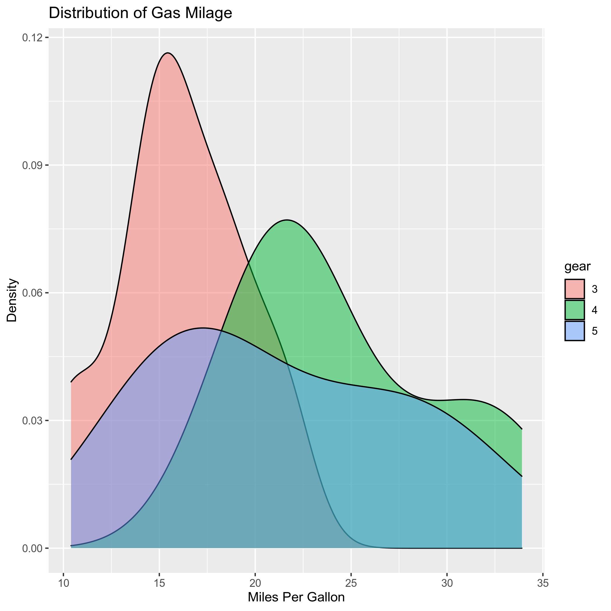

[](https://mybinder.org/v2/gh/jmoldon/analysis/HEAD)

# analysis

Voy a hacer una gráfica con los datos.

# Instalación

Para instalar conda: [here](https://docs.conda.io/projects/conda/en/latest/user-guide/install/index.html#regular-installation)

Instalar en conda environment para tener las dependencias:
```
mamba env create -f environment.yml
```

Clona el repositorio:
```
git clone https://github.com/jmoldon/analysis.git
```

Ejecutar:
```
Rscript script2.r
```

